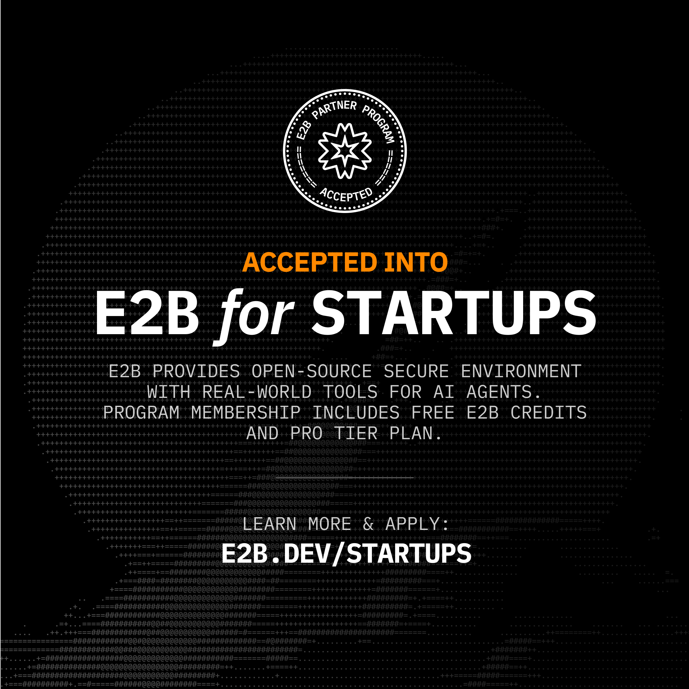

# FfeD-QLC MVP

FfeD-QLC MVP is a public software scaffold for a bounded QLC-style admissibility layer, Docker/CodeProject.AI study-case mapping, and observable sandbox execution.

In this public repo, QLC means **Quasicrystal Lattice Cryptography**: a research protocol for long-term data protection based on structural transformation rather than only conventional encryption. The public MVP does not claim a finished cryptographic standard. It exposes the useful first layer: classify, contain, observe, and decide before sensitive material enters a workflow.

Primary research attribution identifier: [ORCID 0009-0007-2904-0443](https://orcid.org/0009-0007-2904-0443).



Accepted into the **E2B for Startups** program. The program approval email confirms E2B credits and Pro Tier access for sandbox-based AI-agent development. Datadog for Startups onboarding evidence is also present, and the Docker analytics integration is in progress.

The product direction is simple: protect complex AI/research workspaces from accidental data mixing, secret leakage, and untraceable evidence reuse while still letting independent project blocks connect like Lego pieces.

It is intentionally bounded: it does not publish private research logic, secrets, biological claims, clinical claims, or security-certification claims. It gives a clean public base that can be discussed, tested, and extended without mixing study-case data.

## Investor Summary

Modern AI development teams connect repositories, Docker services, API keys, data folders, sandbox tools, and observability stacks very quickly. The risk is that sensitive material crosses boundaries before anyone knows what happened.

FfeD-QLC MVP proposes a lightweight control layer:

```text
incoming evidence or execution request
  -> provenance check
  -> secret-boundary check
  -> admissibility decision
  -> sandboxed execution
  -> observable runtime event
```

The first commercial shape is a developer/research operations tool that sits between local project blocks, sandbox execution, and observability. It does not replace Docker, Datadog, E2B, or GitHub. It coordinates them with a strict gate so each project can remain isolated while still being measurable.

## What It Does

- Defines a minimal evidence gate: `accept`, `suspend`, `reject`.
- Maps three local study-case blocks to CodeProject.AI endpoints.
- Keeps the public model tied to provenance, trust score, and bounded claim scope.
- Provides a Docker image and Compose entrypoint.
- Provides tests for the MVP behavior.
- Documents the E2B + Datadog sponsor demo path.
- Documents the official-badge evidence policy before using sponsor language.
- Defines a defensive image-redaction path using YOLO-style object detection plus text/secret scanning.

## What The Algorithm Protects

The MVP is designed around the practical problem of public and private key handling in already-existing workspaces.

It protects by policy and workflow:

- real `.env` files are excluded from git;
- secret values are never required in public examples;
- sandbox execution receives only the minimum variables it needs;
- Datadog receives runtime metadata, service tags, and counters, not raw keys;
- evidence without provenance is suspended instead of trusted;
- unbounded claims are rejected instead of promoted;
- each Docker study-case block has its own network and persistent volume.

The intended production version would add secret-pattern scanning, redaction, fingerprint-only audit records, per-repo policy files, and signed decision logs. This public MVP is the first small, testable piece of that larger system.

## What Is Public And What Stays Private

Public in this repository:

- the admissibility gate pattern;
- the Docker/CPAI map;
- E2B sandbox smoke logic;
- Datadog labels and non-secret telemetry pattern;
- investor-readable problem framing.

Not public in this repository:

- private keys or `.env` values;
- internal research notebooks;
- full QLC transformation logic;
- unpublished protocol details;
- production cryptographic claims.

This split is intentional: the repository gives investors and sponsors enough to understand the product surface while preserving the deeper research and security logic.

## What QLC Means Here

Quasicrystal Lattice Cryptography is based on the idea that protected data can be transformed through structured, non-periodic lattice rules inspired by quasicrystal geometry. Instead of treating security only as a key-wrapping problem, QLC treats the data, its provenance, its execution context, and its admissibility state as part of the protection surface.

Publicly, the MVP focuses on the operational layer around that protocol:

- each project block keeps its own boundary;
- evidence and execution requests are classified before use;
- public and private keys are never exposed in examples or telemetry;
- sandbox runs receive only the minimum environment needed;
- runtime events are observable without leaking secret values;
- every item receives an explicit `accept`, `suspend`, or `reject` decision.

In practical software terms, this MVP is the first public control surface for a future QLC protocol. It is not yet a cryptographic proof or production security certification.

## Docker/CPAI Base Map

| Study case | CPAI URL | Network identifier | Persistent volume |
|---|---|---|---|
| Quasicrystal | `http://localhost:33168` | `block-quasicrystal` | `studycase-cpai-quasicrystal-data` |
| Neutrosophique | `http://localhost:33268` | `block-neutrosophique` | `studycase-cpai-neutrosophique-data` |
| FNP-QNN | `http://localhost:33368` | `block-fnp-qnn` | `studycase-cpai-fnp-qnn-data` |

The mapped CPAI servers can be managed through Portainer CE when the private local infrastructure is running. This repo only documents the public map and does not require Portainer to run the MVP.

## Install

```bash
python -m venv .venv
source .venv/bin/activate
pip install -e ".[dev]"
```

On Windows PowerShell:

```powershell
python -m venv .venv
.\.venv\Scripts\Activate.ps1
pip install -e ".[dev]"
```

## Use The CLI

Print the default study-case map:

```bash
ffed-qlc map
```

Evaluate one evidence item:

```bash
ffed-qlc gate --source-id paper-001 --source-type whitepaper --trust-score 0.9 --has-provenance
```

Expected output:

```text
accept
```

An unbounded claim is rejected:

```bash
ffed-qlc gate --source-id claim-001 --trust-score 1.0 --has-provenance --claim-scope biological_proof
```

Expected output:

```text
reject
```

## Docker

Build and run:

```bash
docker compose up --build
```

Or build directly:

```bash
docker build -t ffed-qlc-mvp:local .
docker run --rm ffed-qlc-mvp:local map
```

## E2B + Datadog Sponsor Demo

The sponsor-facing MVP is:

```text
evidence -> admissibility gate -> E2B sandbox run -> Docker/Datadog observability
```

E2B is the isolated execution lane. Datadog is the observability lane. The QLC gate is the control lane between them.

Run an optional E2B sandbox smoke:

```bash
pip install -e ".[e2b]"
python scripts/e2b_run_mvp.py
```

The E2B smoke emits a DogStatsD counter to a local Datadog Agent when reachable:

```text
ffed_qlc.e2b.mvp_run
```

Run Docker while the local Datadog Agent is active:

```bash
docker compose up --build
```

Details:

```text
docs/e2b-datadog-sponsor-demo.md
```

Investor-facing explanation:

```text
docs/investor-brief.md
```

Official badge evidence policy:

```text
docs/official-badges-and-evidence.md
```

MicroVM architecture:

```text
docs/e2b-microvm-qlc-architecture.md
```

YOLO-style image secret redaction:

```text
docs/yolo-secret-redaction.md
```

Safe public banner copy for the current repo:

```text
Accepted into E2B for Startups - sandbox smoke path in progress
Datadog for Startups onboarding active - Docker analytics integration in progress
ORCID-attributed research prototype: 0009-0007-2904-0443
```

Do not use stronger Datadog language such as "sponsored by" or "official partner" unless an explicit written approval is present and recorded in the evidence file.

## Test

```bash
pytest
```

## Public Safety Boundary

This repository is public by design. Keep it public-safe:

- no real `.env` files;
- no API keys;
- no private theory notebooks;
- no claims of biological proof;
- no medical/clinical guidance;
- no production security claims without an explicit threat model and tests.

This MVP improves secret hygiene and workflow separation, but it is not yet a complete security product. Production security would require a threat model, automated secret scanning, redaction tests, access-control design, and audit-log hardening.

## Repository Layout

```text
src/ffed_qlc/
  admissibility.py
  docker_map.py
  telemetry.py
  cli.py
tests/
docs/
scripts/
Dockerfile
compose.yaml
```

## License

MIT. See `LICENSE`, `NOTICE`, `AUTHORS.md`, and `CITATION.cff`.
