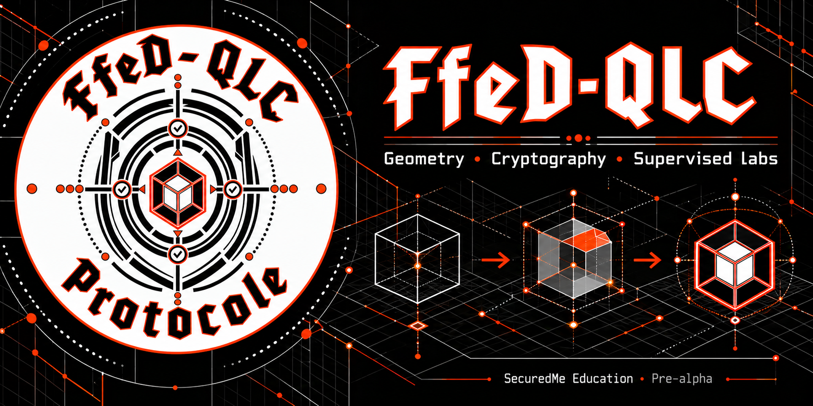

# FfeD-QLC



[](LICENSE)
[](AGENTS.md)
[](https://github.com/SeCuReDmE-main-dev/FfeD-QLC-MVP/issues)
[](https://github.com/SeCuReDmE-main-dev/FfeD-QLC-MVP/commits/main/)
[](https://e2b.dev/startups)

Study bounded admissibility, encryption and explicit data-protection workflows.

[Public surface](https://ffed-qlc.securedme.ca/) · [Tool documentation](https://securedme-main-dev.github.io/securedme-scholarium/en/tools/ffed-qlc/) · [Education hub](https://securedme.ca/product/education/)

**Status:** pre-alpha, active public development. Public pages and a successful local test do not establish a deployed school service. E2B sponsorship recognition is separate from runtime availability and included quota.

## How it works

The Python package validates the QLC workflow and exposes a CLI. Experimental FQLC2 paths remain separately identified; a cryptographic envelope does not establish authority or legal compliance.

## Local development

Record the checkout and existing changes before editing:

```powershell
git status --short --branch
git rev-parse HEAD
```

In a clean development checkout, use the committed lockfile or package manifest. The commands below are setup instructions, not a claim that every dependency or optional service has been verified:

```powershell
python -m venv .venv
.\.venv\Scripts\Activate.ps1
python -m pip install -e ".[dev]"
```

Run the relevant local checks from the repository root; the indicated `Set-Location` is needed only when starting from that root:

```powershell
python -m pytest
```

## Source map

- [src/ffed_qlc](src/ffed_qlc)
- [tests](tests)
- [pyproject.toml](pyproject.toml)

## Practice exercise

Use a synthetic payload to compare an admissible workflow with a rejected one, then inspect the local output without adding credentials.

During an individual course, learners choose suite tools to practice. The eight-week final project is the learner's own tool, submitted by the learner to an eligible hackathon after checking its age, AI, originality and licensing rules.

## Boundaries and privacy

Public contributions must contain no real `.env` files and no API keys. Classroom exercises provide no medical/clinical guidance. This pre-alpha cryptographic workbench requires synthetic inputs and human review; tests do not establish production cryptographic security.

Public boundaries: no real `.env` files, no API keys, no medical/clinical guidance.

Cloud E2B runs are optional and require verified included quota before use. Technical OTLP counters are opt-in and loopback-only; payloads remain outside analytics.

The official school routes are Codex/OpenAI and Antigravity/Gemini with human review. Never distribute raw tokens, learner data, prompts or private correspondence. No hidden learner analytics are added. Public analytics require explicit consent; general autocapture and session replay remain disabled. Optional local technical telemetry is separate from learner records and product audit history.

See [AGENTS.md](AGENTS.md) and [SCHOOL_TOOL_GOVERNANCE.md](SCHOOL_TOOL_GOVERNANCE.md) for current authority and provider boundaries. Maintainer-authorized maintenance follows repository protections and required reviews. General contribution restrictions remain governed by [CONTRIBUTING.md](CONTRIBUTING.md).

## License, authorship and history

The repository's actual license is [SECL-2.0](LICENSE). Keep the license, attribution, notices and safety boundaries when reusing the code.

Jean-Sebastien Beaulieu · [ORCID 0009-0007-2904-0443](https://orcid.org/0009-0007-2904-0443) · [SecuredMe](https://securedme.ca/)

[README source before curation](docs/archive/README-before-curation-2026-09-30.txt) retains the exact previous text, implementation journals and attribution. It is historical: its old telemetry commands, readiness claims and contribution dates are not current operating instructions. [Presentation history](docs/repository-presentation-history-2026-09-30.md) retains previous badges. [GitHub social image](docs/assets/repository/github-social-preview-2026.jpg) accompanies this README.
